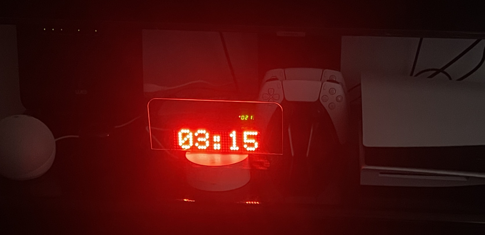
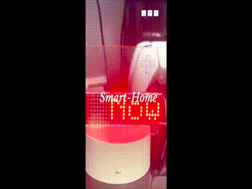
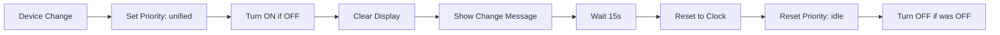
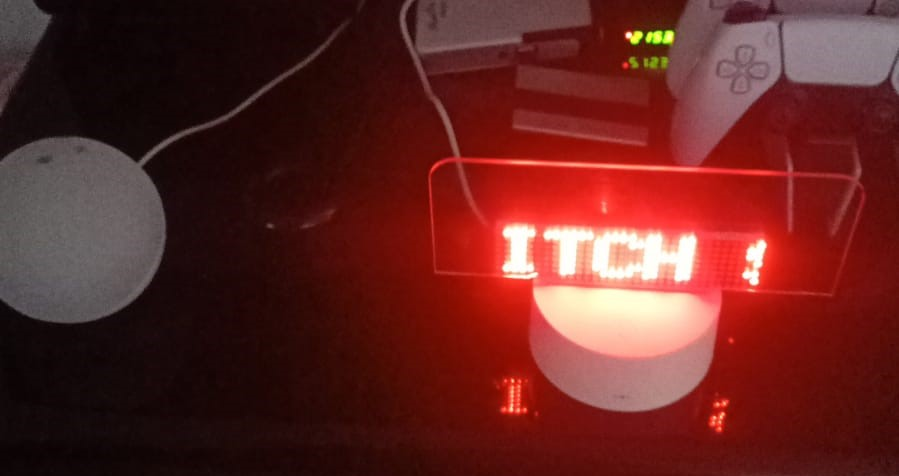

# 🕐 Smart Clock Display System - Event-Driven MAX7219

[](https://www.home-assistant.io/)
[](https://tasmota.github.io/docs/MAX7219/)
[](https://mqtt.org/)
[](https://opensource.org/licenses/MIT)
[](https://github.com/gomgom-40)

> One of the first event-driven MAX7219 display systems featuring an intelligent priority queue for conflict-free smart-home rendering.

> Unlike traditional Arduino polling-based displays, this system uses true event-driven rendering with priority-based display ownership.

> Transform cheap MAX7219 LED matrix into an intelligent event-driven smart clock — $5 hardware, premium features.

## 📖 Overview

This project converts basic **MAX7219 LED Matrix modules** into a **smart display system** with:



---

## 📋 Table of Contents

- [Overview](#-overview)
- [Features](#-features)
- [Hardware Requirements](#-hardware-requirements)
- [Software Stack](#-software-stack)
- [Installation](#-installation)
  - [Hardware Setup](#1-hardware-setup)
  - [Tasmota Configuration](#2-tasmota-configuration)
  - [Home Assistant Setup](#3-home-assistant-setup)
- [Priority System](#-priority-system)
- [Automations](#-automations)
- [Scripts](#-scripts)
- [Advanced Commands](#-advanced-commands)
- [Troubleshooting](#-troubleshooting)
- [Contributing](#-contributing)
- [License](#-license)

---

## 🎯 Overview

An intelligent LED matrix display system that seamlessly integrates with your smart home to show:
- ⏰ Real-time clock (12/24 hour format)
- 🌡️ Temperature and humidity
- 📅 Date display
- 🔔 Alexa Timer/Alarm notifications
- 💡 Smart home device status updates
- 📝 Custom text messages

**Perfect for:** Living rooms, bedrooms, kitchens - any space where you want real-time smart home notifications

---

## 🎥 Demo

[](https://youtu.be/56zUq6O74Sw)

▶️ [Watch on YouTube](https://youtu.be/56zUq6O74Sw)


*Real-time event-driven display showing smart home notifications*

---

## 🛠️ Hardware Requirements

### Required Components

| Component | Specification | Price (approx) |
|-----------|--------------|---------------|
| **LED Matrix** | MAX7219 8x8 modules (1-32) | $3-8 |
| **Microcontroller** | ESP8266 or ESP32 | $4-6 |
| **Power Supply** | 5V/2A USB adapter | $2-3 |
| **Wiring** | Jumper wires | $1 |

**Total Cost:** ~$10-20 (vs $50+ commercial solutions)  
**Total power consumption:** ~1-2W (suitable for 24/7 operation)

---

## 🎯 Quick Start

### System Architecture

```
┌─────────────────────────────────────────────────────────────┐
│                    SMART CLOCK SYSTEM                       │
└─────────────────────────────────────────────────────────────┘
                              │
        ┌─────────────────────┼─────────────────────┐
        │                     │                     │
        ▼                     ▼                     ▼
   ┌────────┐          ┌──────────┐         ┌───────────┐
   │ Alexa  │          │   Home   │         │  Manual   │
   │ Timer/ │          │ Assistant│         │  Control  │
   │ Alarm  │          │ Devices  │         │ (Scripts) │
   └────┬───┘          └─────┬────┘         └─────┬─────┘
        │                    │                    │
        └────────────────────┼────────────────────┘
                             │
                    ┌────────▼────────┐
                    │  Priority Queue │
                    │  ┌───────────┐  │
                    │  │timer_alarm│  │  ← Highest
                    │  ├───────────┤  │
                    │  │ unified   │  │  ← Medium
                    │  ├───────────┤  │
                    │  │   idle    │  │  ← Lowest
                    │  └───────────┘  │
                    └────────┬────────┘
                             │
                    ┌────────▼────────┐
                    │   MQTT Broker   │
                    └────────┬────────┘
                             │
                    ┌────────▼────────┐
                    │    Tasmota      │
                    │   (ESP8266)     │
                    └────────┬────────┘
                             │
                    ┌────────▼────────┐
                    │   MAX7219 LED   │
                    │   Matrix 8x8    │
                    └─────────────────┘
```

---

## ✨ Features

### Core Features
- **Event-Driven Architecture**: Reacts to any smart home state change
- **Intelligent Priority System**: Manages display content based on importance
- **Auto-Brightness Control**: Adjusts brightness based on sunrise/sunset
- **Manual Override**: Full manual control when needed
- **Multi-Device Monitoring**: Tracks 30+ smart home devices
- **Alexa Integration**: Displays timer and alarm notifications
- **Idle Rotation**: Auto-rotates between clock, temperature, and date

### Recent Updates (v1.1.0) 🆕
- ✅ **Fixed idle rotation priority checking** - No more interruptions during rotation
- ✅ **Improved Alexa integration stability** - Compatible with latest Media Player updates
- ✅ **Added debouncing for smoother notifications** - Reduces spam during state changes
- ✅ **Rewrote timer warning system** - More reliable 30-second countdown alerts

### Display Capabilities
- Scrolling text for long messages
- Pixel-level control
- Custom positioning (X/Y coordinates)
- Multiple font support (if compiled with UTF8_LATIN1)
- Adjustable scroll speed
- Blink rate control
- Display rotation (normal/upside-down)

---

## 🧩 Hardware Requirements

### Components List

| Component | Specification | Notes |
|-----------|--------------|-------|
| **Microcontroller** | ESP8266 or ESP32 | WiFi-enabled |
| **LED Matrix** | MAX7219 8x8 modules | Up to 32 modules supported |
| **Power Supply** | 5V DC | 500mA+ (varies with module count) |
| **Wiring** | Jumper wires | DuPont connectors recommended |

### Wiring Diagram

```
ESP8266/ESP32          MAX7219 Module(s)
┌──────────┐          ┌──────────┐
│          │          │          │
│  5V   ───┼──────────┼─ VCC    │
│  GND  ───┼──────────┼─ GND    │
│  DIN  ───┼──────────┼─ DIN    │
│  CS   ───┼──────────┼─ CS     │
│  CLK  ───┼──────────┼─ CLK    │
│          │          │          │
└──────────┘          └──────────┘
```

### Pin Configuration

| MAX7219 Pin | ESP Pin | Tasmota Configuration |
|-------------|---------|----------------------|
| VCC | 5V | - |
| GND | GND | - |
| DIN | GPIO (your choice) | MAX7219 DIN |
| CS | GPIO (your choice) | MAX7219 CS |
| CLK | GPIO (your choice) | MAX7219 CLK |

**⚠️ Important Notes:**
- Ensure 5V power supply is stable
- Each module can draw up to 200mA at full brightness
- For multiple modules, daisy-chain VCC, GND, DIN, CS, and CLK
- Module count affects total power consumption

---

## 💻 Software Stack

```
Technology Stack:
├── Tasmota Firmware
│   └── Custom build with USE_DISPLAY_MAX7219_MATRIX
├── Home Assistant
│   ├── MQTT Integration
│   ├── Automations
│   ├── Scripts
│   └── Input Helpers
├── MQTT Broker
│   └── Mosquitto or built-in HA broker
└── Alexa Integration (optional)
    └── For timer/alarm notifications
```

---

## 🚀 Installation

### 1. Hardware Setup

#### Step 1: Flash Tasmota
1. Download the precompiled MAX7219 Tasmota binary:
   - URL: https://tinyurl.com/tasmota-max7219DMD
   - File: `tasmota-max7219.bin`

2. Flash using Tasmotizer:
   ```bash
   # Use included Tasmotizer tool
   ./tasmotizer-1.2.exe
   ```

3. Connect to Tasmota WiFi AP and configure WiFi credentials

#### Step 2: Physical Wiring
1. Connect MAX7219 to ESP according to wiring diagram above
2. If using multiple modules, daisy-chain them:
   ```
   ESP → Module 1 → Module 2 → Module 3 → ...
   ```
3. Connect 5V power supply

---

### 2. Tasmota Configuration

#### GPIO Configuration
1. Navigate to **Configuration → Configure Module**
2. Set module type to **Generic (18)**
3. Assign pins:
   - DIN hardware pin → **MAX7219 DIN**
   - CS hardware pin → **MAX7219 CS**
   - CLK hardware pin → **MAX7219 CLK**
4. Save and wait for reboot

#### Display Initialization
Execute these commands in Tasmota Console:

```bash
# Set display type and mode
DisplayModel 19
DisplayMode 0

# Configure display size (adjust based on your modules)
DisplayWidth 8        # 8 pixels per module × number of horizontal modules
DisplayHeight 8       # 8 pixels per module × number of vertical modules

# Turn on display
Power ON

# Test display
DisplayClock 1        # Show clock in 12-hour format
```

#### Configure Auto-Brightness Rules

**Rule 1: Auto-start clock on boot**
```javascript
Rule1 ON system#boot DO backlog delay 30; displayclock 1 ENDON
Rule1 1
```

**Rule 2: Sunrise/Sunset brightness adjustment**

*Simple version:*
```javascript
Rule2 ON System#Boot DO Var1 0 ENDON 
      ON Time#Sunrise DO IF Var1==0 THEN DisplayDimmer 10 ENDIF ENDON 
      ON Time#Sunset DO IF Var1==0 THEN DisplayDimmer 5 ENDIF ENDON 
      ON Rules#Timer=1 DO Var1 0 ENDON
Rule2 1
```

*Advanced version with time validation:*
```javascript
Rule2 ON System#Boot DO Var1 0 ENDON 
      ON Time#Sunrise DO IF (Var1==0) DisplayDimmer 10 ENDIF ENDON 
      ON Time#Sunset DO IF (Var1==0) DisplayDimmer 5 ENDIF ENDON 
      ON Rules#Timer=1 DO Backlog Var1 0; IF (Time<Sunrise OR Time>=Sunset) DisplayDimmer 5 ELSE DisplayDimmer 10 ENDIF ENDON
Rule2 1
```

**Variable Explanation:**
- `Var1 = 0`: Auto-brightness enabled
- `Var1 = 1`: Manual brightness mode (disables auto-adjustment)
- `DisplayDimmer 10`: Daytime brightness (10%)
- `DisplayDimmer 5`: Nighttime brightness (5%)

#### MQTT Topic Structure

```
📡 MQTT Topics:
├── cmnd/tasmota_46041E/          # Command topics
│   ├── POWER                     # ON/OFF
│   ├── Displaytext               # Send text to display
│   ├── Displayclock              # 0=off, 1=12h, 2=24h
│   ├── Displayclear              # Clear display
│   ├── DisplayDimmer             # Brightness (0-100)
│   └── DisplayScrollDelay        # Scroll speed (0-15)
└── stat/tasmota_46041E/          # Status topics
    └── RESULT                    # Command responses
```

**Note:** Replace `tasmota_46041E` with your device's MQTT topic

---

### 3. Home Assistant Setup

#### Required Input Helpers

Add to your `configuration.yaml`:

```yaml
input_number:
  smart_clock_brightness:
    name: Smart Clock Brightness
    min: 0
    max: 100
    step: 5
    initial: 10
    icon: mdi:brightness-6

input_text:
  text_to_display:
    name: Text to Display on Smart Clock
    max: 100
    icon: mdi:text

input_select:
  smart_clock_priority:
    name: Smart Clock Display Priority
    options:
      - idle
      - unified
      - timer_alarm
    initial: idle
    icon: mdi:priority-high
```

#### MQTT Switch Entity

```yaml
switch:
  - platform: mqtt
    name: "Smart Clock"
    unique_id: smart_clock_display
    state_topic: "stat/tasmota_46041E/POWER"
    command_topic: "cmnd/tasmota_46041E/POWER"
    payload_on: "ON"
    payload_off: "OFF"
    availability_topic: "tele/tasmota_46041E/LWT"
    payload_available: "Online"
    payload_not_available: "Offline"
```

#### Scripts

Create file `scripts.yaml` (or add to existing):

```yaml
clear_smart_clock_display:
  alias: Clear Smart Clock Display
  icon: mdi:eraser
  sequence:
    - service: mqtt.publish
      data:
        topic: cmnd/tasmota_46041E/Displayclock
        payload: '0'
    - service: mqtt.publish
      data:
        topic: cmnd/tasmota_46041E/Displayclear
        payload: ''

display_text_on_smart_clock:
  alias: Display Text on Smart Clock
  icon: mdi:text-box
  sequence:
    - service: mqtt.publish
      data:
        topic: cmnd/tasmota_46041E/Displaytext
        payload: '{{ states("input_text.text_to_display") }}'

smart_clock_set_brightness:
  alias: Set Smart Clock Brightness
  description: Manual brightness with auto-restore after 30 minutes
  icon: mdi:brightness-6
  mode: restart
  sequence:
    - service: mqtt.publish
      data:
        topic: "cmnd/tasmota_46041E/DisplayDimmer"
        payload: "{{ states('input_number.smart_clock_brightness') | int }}"
    
    - delay:
        seconds: 1800  # 30 minutes
    
    # Auto-restore based on sun position
    - service: mqtt.publish
      data:
        topic: "cmnd/tasmota_46041E/DisplayDimmer"
        payload: >
          
            5
          
            10
          
```

#### Automations

Create file `automations/smart_clock.yaml`:

See [Automations](#-automations) section below for detailed automation configurations.

---

## 🎚️ Priority System

The system uses an intelligent priority queue to manage what gets displayed:

### Priority Levels

```yaml
┌─────────────────────────────────────┐
│ timer_alarm  (Highest Priority)     │  ← Alexa Timer/Alarm notifications
├─────────────────────────────────────┤
│ unified      (Medium Priority)      │  ← Smart home device state changes
├─────────────────────────────────────┤
│ idle         (Lowest Priority)      │  ← Clock rotation (clock/temp/date)
└─────────────────────────────────────┘
```

### Priority Behavior

- **timer_alarm**: Cannot be interrupted by any other automation
- **unified**: Can interrupt `idle` only
- **idle**: Can be interrupted by any higher priority

### State Management

All automations follow this pattern:

```yaml
# 1. Clean any stuck priority
- service: input_select.select_option
  target:
    entity_id: input_select.smart_clock_priority
  data:
    option: idle

# 2. Set new priority
- service: input_select.select_option
  target:
    entity_id: input_select.smart_clock_priority
  data:
    option: unified  # or timer_alarm

# 3. Do work...

# 4. Reset priority
- service: input_select.select_option
  target:
    entity_id: input_select.smart_clock_priority
  data:
    option: idle
```

This ensures clean transitions and prevents stuck states.

---

## 🤖 Automations

### 1. Brightness Slider Control

**ID:** `smart_clock_brightness_trigger`

Triggers the brightness script when the slider changes.

```yaml
automation:
  - id: smart_clock_brightness_trigger
    alias: Smart Clock - Brightness Slider Changed
    description: Calls brightness script when slider changes
    mode: restart
    trigger:
      - platform: state
        entity_id: input_number.smart_clock_brightness
    action:
      - service: script.smart_clock_set_brightness
```

---

### 2. Idle Page Rotation

**ID:** `smart-clock-idle-rotation`

Rotates between clock, temperature, and date every 10 minutes when no other content is active.

```yaml
automation:
  - id: smart-clock-idle-rotation
    alias: Smart Clock - Idle Page Rotation
    description: Rotates between clock, temperature, and date every 10 minutes
    mode: restart
    trigger:
      - platform: time_pattern
        minutes: /10
    condition:
      - condition: state
        entity_id: switch.smart_clock
        state: 'on'
      - condition: state
        entity_id: input_select.smart_clock_priority
        state: 'idle'
    action:
      # Show clock
      - service: mqtt.publish
        data:
          topic: cmnd/tasmota_46041E/Displayclear
          payload: ''
      - delay:
          milliseconds: 200
      - service: mqtt.publish
        data:
          topic: cmnd/tasmota_46041E/Displayclock
          payload: '1'
      - delay:
          seconds: 5
      
      # Show temperature
      - service: mqtt.publish
        data:
          topic: cmnd/tasmota_46041E/Displayclear
          payload: ''
      - service: mqtt.publish
        data:
          topic: cmnd/tasmota_46041E/Displayclock
          payload: '0'
      - delay:
          milliseconds: 200
      - service: mqtt.publish
        data:
          topic: cmnd/tasmota_46041E/Displaytext
          payload: >
            
            
              {{ temp | float | round(1) }}C
            
              --C
            
      - delay:
          seconds: 5
      
      # Show date
      - service: mqtt.publish
        data:
          topic: cmnd/tasmota_46041E/Displayclear
          payload: ''
      - service: mqtt.publish
        data:
          topic: cmnd/tasmota_46041E/Displaytext
          payload: '{{ now().strftime("%d/%m") }}'
      - delay:
          seconds: 5
      
      # Back to clock
      - service: mqtt.publish
        data:
          topic: cmnd/tasmota_46041E/Displayclear
          payload: ''
      - delay:
          milliseconds: 200
      - service: mqtt.publish
        data:
          topic: cmnd/tasmota_46041E/Displayclock
          payload: '1'
```

**Display Sequence:**
```
⏰ 12:45 → 🌡️ 24.5°C → 📅 15/02 → ⏰ 12:45 → ...
   (5s)      (5s)       (5s)      (5s)
```

---

### 3. Unified Display Sender (Most Important!)

**ID:** `smart-clock-unified-sender`

Monitors 30+ smart home devices and displays state changes.

**Supported Device Types:**
- Switches (13 entities)
- Lights (6 entities)
- Media Players (3 entities)

**Flow Diagram:**


**Full Automation:**

```yaml
automation:
  - id: smart-clock-unified-sender
    alias: Smart Clock - Unified Display Sender
    description: Sends all important events to smart clock
    mode: queued
    triggers:
      - platform: state
        entity_id:
          # Switches
          - switch.fyshh_lshhn
          - switch.tlfzywn_lnwm
          - switch.living_room_switch_switch_1
          - switch.living_room_switch_switch_2
          - switch.living_room_switch_switch_3
          - switch.mfth_nwr_lnwm
          - switch.nwr_lnwm
          - switch.mfth_khrb_lnwm
          - switch.nwr_lntryh
          - switch.nwr_lslm
          - switch.nwr_lhmm
          - switch.gpiod_speaker_power
          - switch.gpiod_fan_rpby
          # Lights
          - light.nwr_lyd_lnwm
          - light.nwr_lyd_lm_yshh
          - light.kitchen_light
          - light.nwr_lsfrh
          # Media Players
          - media_player.living_room_tv
          - media_player.playstation_5
          - media_player.fire_tv
    
    conditions:
      - condition: template
        value_template: >
          {{ trigger.from_state is not none
             and trigger.to_state is not none
             and trigger.from_state.state != trigger.to_state.state }}
      
      - condition: template
        value_template: "{{ states('input_select.smart_clock_priority') != 'timer_alarm' }}"
    
    actions:
      # Set priority
      - service: input_select.select_option
        target:
          entity_id: input_select.smart_clock_priority
        data:
          option: unified
      
      # Store if display was off
      - variables:
          display_power_entity: switch.smart_clock
          was_off: '{{ is_state(display_power_entity, "off") }}'
      
      # Turn on if needed
      - if:
          - '{{ was_off }}'
        then:
          - service: mqtt.publish
            data:
              topic: cmnd/tasmota_46041E/POWER
              payload: 'ON'
          - delay:
              milliseconds: 300
      
      # Clear and prepare display
      - service: mqtt.publish
        data:
          topic: cmnd/tasmota_46041E/Displayclear
          payload: ''
      - service: mqtt.publish
        data:
          topic: cmnd/tasmota_46041E/Displayclock
          payload: '0'
      - delay:
          milliseconds: 200
      
      # Generate message
      - variables:
          entity: '{{ trigger.entity_id }}'
          state: '{{ trigger.to_state.state }}'
          name: '{{ entity.split(".")[-1] | replace("_", " ") | upper }}'
      
      # Display message
      - service: mqtt.publish
        data:
          topic: cmnd/tasmota_46041E/Displaytext
          payload: >
            
              Motion {{ name }} : Now Is {{ 'ON' if state == 'on' else 'OFF' }}
            
              {{ name }} : Now Is {{ 'ON' if state == 'on' else 'OFF' }}
            
              {{ name }} : Now Is {{ 'ON' if state == 'on' else 'OFF' }}
            
              Temp {{ state }}°C
            
              Hum {{ state }}%
            
              {{ name }} : Now Is {{ 'Playing' if state == 'playing' else state|capitalize }}
            
              {{ name }} {{ state }}
            
      
      # Wait
      - delay:
          seconds: 15
      
      # Return to clock
      - service: mqtt.publish
        data:
          topic: cmnd/tasmota_46041E/Displayclear
          payload: ''
      - service: mqtt.publish
        data:
          topic: cmnd/tasmota_46041E/Displayclock
          payload: '0'
      - delay:
          milliseconds: 200
      - service: mqtt.publish
        data:
          topic: cmnd/tasmota_46041E/Displayclock
          payload: '1'
      
      # Reset priority
      - service: input_select.select_option
        target:
          entity_id: input_select.smart_clock_priority
        data:
          option: idle
      
      # Turn off if was off
      - if:
          - condition: template
            value_template: '{{ was_off }}'
        then:
          - service: mqtt.publish
            data:
              topic: cmnd/tasmota_46041E/POWER
              payload: 'OFF'
```

**Example Messages:**
```
"LIVING ROOM SWITCH 1 : Now Is ON"
"KITCHEN LIGHT : Now Is OFF"
"LIVING ROOM TV : Now Is Playing"
"Temp 24.5°C"
```

---

### 4. Alexa Timer/Alarm Display

**ID:** `smart_clock_alexa_timer_alarm`

Displays Alexa timer and alarm notifications from Echo devices.

**Monitored Sensors:**
- `sensor.kitchen_echo_dot_next_timer`
- `sensor.kitchen_echo_dot_next_alarm`
- `sensor.living_room_echo_dot_next_timer`
- `sensor.living_room_echo_dot_next_alarm`

**Scenarios:**

1. **Timer/Alarm Set:**
   ```
   Display: "Kitchen Timer at 14:30"
   Duration: 10 seconds
   Then: Back to clock
   ```

2. **Timer/Alarm Ended:**
   ```
   Display: "Alarm OFF"
   Duration: 5 seconds
   Then: Back to clock
   ```

**Full Automation:**

```yaml
automation:
  - id: smart_clock_alexa_timer_alarm
    alias: Smart Clock - Alexa Timer/Alarm Display
    mode: restart
    triggers:
      # Kitchen Timer
      - platform: state
        entity_id: sensor.kitchen_echo_dot_next_timer
        not_to:
          - unknown
          - unavailable
        id: kitchen_timer_set
      
      - platform: state
        entity_id: sensor.kitchen_echo_dot_next_timer
        to: unknown
        id: kitchen_timer_off
      
      # Kitchen Alarm
      - platform: state
        entity_id: sensor.kitchen_echo_dot_next_alarm
        not_to:
          - unknown
          - unavailable
        id: kitchen_alarm_set
      
      - platform: state
        entity_id: sensor.kitchen_echo_dot_next_alarm
        to: unknown
        id: kitchen_alarm_off
      
      # Living Room Timer
      - platform: state
        entity_id: sensor.living_room_echo_dot_next_timer
        not_to:
          - unknown
          - unavailable
        id: living_timer_set
      
      - platform: state
        entity_id: sensor.living_room_echo_dot_next_timer
        to: unknown
        id: living_timer_off
      
      # Living Room Alarm
      - platform: state
        entity_id: sensor.living_room_echo_dot_next_alarm
        not_to:
          - unknown
          - unavailable
        id: living_alarm_set
      
      - platform: state
        entity_id: sensor.living_room_echo_dot_next_alarm
        to: unknown
        id: living_alarm_off
    
    conditions:
      - condition: state
        entity_id: switch.smart_clock
        state: "on"
      
      - condition: template
        value_template: >
          {{ states('input_select.smart_clock_priority') in ['idle','timer_alarm'] }}
    
    actions:
      # Clean stuck priority
      - service: input_select.select_option
        target:
          entity_id: input_select.smart_clock_priority
        data:
          option: idle
      
      # Set priority
      - service: input_select.select_option
        target:
          entity_id: input_select.smart_clock_priority
        data:
          option: timer_alarm
      
      - choose:
          # Timer/Alarm Set
          - conditions:
              - condition: trigger
                id:
                  - kitchen_timer_set
                  - kitchen_alarm_set
                  - living_timer_set
                  - living_alarm_set
            sequence:
              - variables:
                  timer_time: >
                    
                    
                      --:--
                    
                      {{ as_timestamp(raw, 0) | timestamp_custom('%H:%M', true) }}
                    
                  location: >
                    KitchenLiving
                  type: >
                    TimerAlarm
              
              - service: mqtt.publish
                data:
                  topic: "cmnd/tasmota_46041E/Displayclear"
                  payload: ""
              
              - service: mqtt.publish
                data:
                  topic: "cmnd/tasmota_46041E/Displayclock"
                  payload: "0"
              
              - delay:
                  milliseconds: 200
              
              - service: mqtt.publish
                data:
                  topic: "cmnd/tasmota_46041E/Displaytext"
                  payload: "{{ location }} {{ type }} at {{ timer_time }}"
              
              - delay:
                  seconds: 10
              
              - service: mqtt.publish
                data:
                  topic: "cmnd/tasmota_46041E/Displayclear"
                  payload: ""
              
              - service: mqtt.publish
                data:
                  topic: "cmnd/tasmota_46041E/Displayclock"
                  payload: "0"
              
              - delay:
                  milliseconds: 200
              
              - service: mqtt.publish
                data:
                  topic: "cmnd/tasmota_46041E/Displayclock"
                  payload: "1"
          
          # Timer/Alarm OFF
          - conditions:
              - condition: trigger
                id:
                  - kitchen_timer_off
                  - kitchen_alarm_off
                  - living_timer_off
                  - living_alarm_off
            sequence:
              - service: mqtt.publish
                data:
                  topic: "cmnd/tasmota_46041E/Displayclear"
                  payload: ""
              
              - service: mqtt.publish
                data:
                  topic: "cmnd/tasmota_46041E/Displayclock"
                  payload: "0"
              
              - delay:
                  milliseconds: 200
              
              - service: mqtt.publish
                data:
                  topic: "cmnd/tasmota_46041E/Displaytext"
                  payload: "Alarm OFF"
              
              - delay:
                  seconds: 5
              
              - service: mqtt.publish
                data:
                  topic: "cmnd/tasmota_46041E/Displayclear"
                  payload: ""
              
              - service: mqtt.publish
                data:
                  topic: "cmnd/tasmota_46041E/Displayclock"
                  payload: "0"
              
              - delay:
                  milliseconds: 200
              
              - service: mqtt.publish
                data:
                  topic: "cmnd/tasmota_46041E/Displayclock"
                  payload: "1"
      
      # Reset priority
      - service: input_select.select_option
        target:
          entity_id: input_select.smart_clock_priority
        data:
          option: idle
```

---

### 5. Timer Warning (30 seconds before)

**ID:** `smart_clock_timer_warning`

Displays a warning 30 seconds before any timer/alarm expires.

**How it works:**
- Runs every 15-60 seconds
- Checks all 4 timer/alarm sensors
- If remaining time is between 27-33 seconds, displays warning
- Uses 6-second window or more to ensure warning is not missed

```yaml
automation:
  - id: smart_clock_timer_warning
    alias: Smart Clock - Timer Warning (30 seconds before)
    mode: single
    triggers:
      - platform: time_pattern
        seconds: "/15"
    
    conditions:
      - condition: state
        entity_id: switch.smart_clock
        state: "on"
      
      - condition: template
        value_template: "{{ states('input_select.smart_clock_priority') != 'timer_alarm' }}"
    
    actions:
      # Clean stuck priority
      - service: input_select.select_option
        target:
          entity_id: input_select.smart_clock_priority
        data:
          option: idle
      
      # Set priority
      - service: input_select.select_option
        target:
          entity_id: input_select.smart_clock_priority
        data:
          option: timer_alarm
      
      # Check all 4 sensors
      - repeat:
          count: 4
          sequence:
            - variables:
                entity: >
                  sensor.kitchen_echo_dot_next_timer
                  sensor.kitchen_echo_dot_next_alarm
                  sensor.living_room_echo_dot_next_timer
                  sensor.living_room_echo_dot_next_alarm
                  
                loc: >
                  KitchenLiving
                typ: >
                  TimerAlarm
                remaining: >
                  {{ (as_timestamp(states(entity), 0) - as_timestamp(now())) | int }}
            
            # Show warning if 27-33 seconds remaining
            - if:
                - condition: template
                  value_template: >
                    {{ states(entity) not in ['unknown','unavailable'] 
                       and remaining >= 27 and remaining <= 33 }}
              then:
                - service: mqtt.publish
                  data:
                    topic: "cmnd/tasmota_46041E/Displayclear"
                    payload: ""
                
                - service: mqtt.publish
                  data:
                    topic: "cmnd/tasmota_46041E/Displayclock"
                    payload: "0"
                
                - delay:
                    milliseconds: 200
                
                - service: mqtt.publish
                  data:
                    topic: "cmnd/tasmota_46041E/Displaytext"
                    payload: "{{ loc }} {{ typ }} in 30s"
                
                - delay:
                    seconds: 10
                
                - service: mqtt.publish
                  data:
                    topic: "cmnd/tasmota_46041E/Displayclear"
                    payload: ""
                
                - service: mqtt.publish
                  data:
                    topic: "cmnd/tasmota_46041E/Displayclock"
                    payload: "0"
                
                - delay:
                    milliseconds: 200
                
                - service: mqtt.publish
                  data:
                    topic: "cmnd/tasmota_46041E/Displayclock"
                    payload: "1"
      
      # Reset priority
      - service: input_select.select_option
        target:
          entity_id: input_select.smart_clock_priority
        data:
          option: idle
```

---

## 📜 Scripts

### 1. Clear Display

Clears the display and stops the clock.

```yaml
clear_smart_clock_display:
  alias: Clear Smart Clock Display
  icon: mdi:eraser
  sequence:
    - service: mqtt.publish
      data:
        topic: cmnd/tasmota_46041E/Displayclock
        payload: '0'
    - service: mqtt.publish
      data:
        topic: cmnd/tasmota_46041E/Displayclear
        payload: ''
```

**Usage:**
```yaml
service: script.clear_smart_clock_display
```

---

### 2. Display Custom Text

Displays text from the input helper.

```yaml
display_text_on_smart_clock:
  alias: Display Text on Smart Clock
  icon: mdi:text-box
  sequence:
    - service: mqtt.publish
      data:
        topic: cmnd/tasmota_46041E/Displaytext
        payload: '{{ states("input_text.text_to_display") }}'
```

**Usage:**
1. Set text in `input_text.text_to_display`
2. Call script:
   ```yaml
   service: script.display_text_on_smart_clock
   ```

---

### 3. Manual Brightness with Auto-Restore

Sets manual brightness, then auto-restores after 30 minutes.

```yaml
smart_clock_set_brightness:
  alias: Set Smart Clock Brightness
  description: Manual brightness with auto-restore after 30 minutes
  icon: mdi:brightness-6
  mode: restart
  sequence:
    # Apply manual brightness immediately
    - service: mqtt.publish
      data:
        topic: "cmnd/tasmota_46041E/DisplayDimmer"
        payload: "{{ states('input_number.smart_clock_brightness') | int }}"
    
    # Wait 30 minutes
    - delay:
        seconds: 1800
    
    # Restore automatic brightness based on sun
    - service: mqtt.publish
      data:
        topic: "cmnd/tasmota_46041E/DisplayDimmer"
        payload: >
          
            5
          
            10
          
```

**How it works:**
1. Immediately applies brightness from slider
2. After 30 minutes, automatically restores sun-based brightness
3. Uses `mode: restart` to reset timer if brightness changed again

---

## 🎮 Advanced Commands

### Basic Display Commands

```bash
# Text Display
DisplayText <text>           # Display text (scrolls if too long)
DisplayClear                 # Clear the display

# Clock
DisplayClock 0               # Turn off clock
DisplayClock 1               # 12-hour format clock
DisplayClock 2               # 24-hour format clock

# Brightness
DisplayDimmer <0-100>        # Set brightness (0=off, 100=max)

# Scroll Speed
DisplayScrollDelay <0-15>    # Set scroll speed (0=fastest, 15=slowest)
                             # Minimum: 50ms per pixel at delay 0
```

### Pixel Control

```bash
# Turn on/off individual pixels
# Format: DisplayPixel <x> <y> <state>
DisplayPixel 0 0 1           # Turn on pixel at (0,0)
DisplayPixel 0 0 0           # Turn off pixel at (0,0)

# Alternative syntax:
Display Pixel 0 0 1
```

### Text Positioning

```bash
# Display text at specific X/Y coordinates
# Format: DisplayTextXY <x> <y> <text>
DisplayTextXY 0 0 Hello      # Text starts at top-left corner
DisplayTextXY 2 4 Hi         # Text starts at position (2,4)

# Alternative syntax:
Display TextXY 0 0 Hello
```

### Display Configuration

```bash
# Size Configuration
# (8 pixels × number of modules)
DisplayWidth <8-256>         # Set display width in pixels
DisplayHeight <8-256>        # Set display height in pixels

# Orientation
DisplayRotate 0              # Normal orientation (device 0 at top-left)
DisplayRotate 2              # Upside down (device 0 at bottom-right)

# Blink Effect
DisplayBlinkrate 0           # No blinking
DisplayBlinkrate 1           # Slow blink
DisplayBlinkrate 2           # Medium blink
DisplayBlinkrate 3           # Fast blink

# Power Control
Power ON                     # Turn display on
Power OFF                    # Turn display off (retains buffer)
```

### Font Options

**Note:** These require compilation with `USE_UTF8_LATIN1`

```bash
Display Font 0               # Default font
Display Font 1               # Alternative font 1
Display Font 2               # Alternative font 2
Display Font 3               # Alternative font 3
Display Font 4               # Alternative font 4

Display Size 1               # Normal size
Display Size 2               # 2x size (if supported)
```

### Information Commands

```bash
Display Model                # Show current display model
DisplayWidth                 # Show current width setting
DisplayHeight                # Show current height setting
Status 0                     # Show full device status
```

---

## 🛠️ Troubleshooting

### Common Issues

#### 1. Display Not Working

**Checklist:**
- ✅ Verify 5V power supply is stable
- ✅ Check all wiring connections (VCC, GND, DIN, CS, CLK)
- ✅ Confirm GPIO configuration in Tasmota
- ✅ Verify `DisplayModel 19` is set
- ✅ Verify `DisplayMode 0` is set
- ✅ Ensure `Power ON` has been executed

**Test Commands:**
```bash
# In Tasmota Console:
DisplayModel 19
DisplayMode 0
Power ON
DisplayClock 1
```

---

#### 2. Text Not Appearing

**Troubleshooting Steps:**

```bash
# 1. Stop the clock first
DisplayClock 0

# 2. Clear the display
DisplayClear

# 3. Test with simple text
DisplayText Test

# 4. Check brightness
DisplayDimmer 50
```

**If still not working:**
- Check `DisplayWidth` and `DisplayHeight` match your module count
- Verify MQTT connection in Home Assistant
- Check Tasmota console for errors

---

#### 3. Brightness Issues

**Check Auto-Brightness Rules:**

```bash
# View Rule2 (auto-brightness)
Rule2

# Temporarily disable for testing
Rule2 0

# Test manual brightness
DisplayDimmer 50

# Re-enable Rule2
Rule2 1
```

**Verify Sun Sensor:**
- Check that `sun.sun` entity exists in Home Assistant
- Verify sunrise/sunset times are correct for your location

---

#### 4. Automations Not Triggering

**Debug Steps:**

1. **Check MQTT Connection**
   ```yaml
   # In Home Assistant Developer Tools → MQTT
   Topic: stat/tasmota_46041E/RESULT
   # Subscribe and send a test command
   ```

2. **Verify Entity States**
   ```yaml
   # Developer Tools → States
   # Check that monitored entities are updating
   ```

3. **Review Automation Traces**
   ```yaml
   # Settings → Automations & Scenes
   # Click on automation → "Traces"
   # Check for errors or conditions that failed
   ```

4. **Check Priority State**
   ```yaml
   # If automation seems stuck:
   service: input_select.select_option
   target:
     entity_id: input_select.smart_clock_priority
   data:
     option: idle
   ```

---

#### 5. Priority System Stuck

**Manual Reset:**

```yaml
# Reset priority to idle
service: input_select.select_option
target:
  entity_id: input_select.smart_clock_priority
data:
  option: idle

# Clear display
service: script.clear_smart_clock_display

# Restart clock
service: mqtt.publish
data:
  topic: cmnd/tasmota_46041E/Displayclock
  payload: '1'
```

---

#### 6. Alexa Integration Not Working

**Requirements:**
- Alexa Media Player integration must be installed
- Echo devices must be configured in Home Assistant
- Sensor entities must be enabled

**Check Sensors:**
```yaml
# Verify these sensors exist:
sensor.kitchen_echo_dot_next_timer
sensor.kitchen_echo_dot_next_alarm
sensor.living_room_echo_dot_next_timer
sensor.living_room_echo_dot_next_alarm
```

**If sensors are unavailable:**
1. Restart Home Assistant
2. Check Alexa Media Player integration configuration
3. Re-authenticate with Amazon account if needed

---

### Diagnostic Commands

```bash
# In Tasmota Console:

# Full status information
Status 0

# Basic device info
Status 1

# Enable detailed logging
Weblog 4

# Check MQTT connection
Status 6

# View all rules
Rule1
Rule2
Rule3
```

---

### MQTT Debugging

**Subscribe to all status messages:**

```yaml
# In Home Assistant Developer Tools → MQTT
# Subscribe to topic:
stat/tasmota_46041E/#

# Or for all Tasmota messages:
tasmota/#
```

**Send test commands:**

```yaml
# Test topic: cmnd/tasmota_46041E/Displaytext
# Payload: Hello Test
```

---

### Performance Issues

**If display is laggy or unresponsive:**

1. **Reduce MQTT traffic:**
   ```yaml
   # In automations, reduce trigger frequency
   # Use mode: queued instead of mode: single
   ```

2. **Optimize scroll speed:**
   ```bash
   # Faster scrolling = less buffer usage
   DisplayScrollDelay 0
   ```

3. **Check WiFi signal:**
   ```bash
   # In Tasmota Console
   Status 11
   # Look for "WiFi RSSI" - should be > -70 dBm
   ```

---

## 🎓 Tips & Best Practices

### 1. Power Management

**Auto-off when home is empty:**

```yaml
automation:
  - alias: Smart Clock - Auto Power Off
    trigger:
      - platform: state
        entity_id: binary_sensor.house_occupied
        to: 'off'
        for:
          minutes: 30
    action:
      - service: switch.turn_off
        target:
          entity_id: switch.smart_clock
```

**Auto-on when home:**

```yaml
automation:
  - alias: Smart Clock - Auto Power On
    trigger:
      - platform: state
        entity_id: binary_sensor.house_occupied
        to: 'on'
    action:
      - service: switch.turn_on
        target:
          entity_id: switch.smart_clock
```

---

### 2. Custom Notifications

**Doorbell notification:**

```yaml
automation:
  - alias: Smart Clock - Doorbell Alert
    trigger:
      - platform: state
        entity_id: binary_sensor.doorbell
        to: 'on'
    action:
      - service: mqtt.publish
        data:
          topic: cmnd/tasmota_46041E/Displaytext
          payload: "🔔 DOORBELL!"
      - delay:
          seconds: 10
      - service: mqtt.publish
        data:
          topic: cmnd/tasmota_46041E/Displayclock
          payload: '1'
```

**Security alert:**

```yaml
automation:
  - alias: Smart Clock - Security Alert
    trigger:
      - platform: state
        entity_id: binary_sensor.front_door
        to: 'on'
    condition:
      - condition: state
        entity_id: alarm_control_panel.home
        state: 'armed_away'
    action:
      - service: mqtt.publish
        data:
          topic: cmnd/tasmota_46041E/Displaytext
          payload: "⚠️ DOOR OPEN!"
```

---

### 3. Weather Display

```yaml
automation:
  - alias: Smart Clock - Morning Weather
    trigger:
      - platform: time
        at: "07:00:00"
    action:
      - service: mqtt.publish
        data:
          topic: cmnd/tasmota_46041E/Displaytext
          payload: >
            
            
            {{ temp }}C {{ condition }}
      - delay:
          seconds: 15
      - service: mqtt.publish
        data:
          topic: cmnd/tasmota_46041E/Displayclock
          payload: '1'
```

---

### 4. Multiple Displays

**Scale to multiple rooms:**

```yaml
# Room 1 (Living Room)
Topic: cmnd/tasmota_46041E/*

# Room 2 (Bedroom)
Topic: cmnd/tasmota_XXXXXX/*

# Room 3 (Kitchen)
Topic: cmnd/tasmota_YYYYYY/*
```

**Broadcast to all displays:**

```yaml
service: mqtt.publish
data:
  topic: cmnd/tasmotas/Displaytext
  payload: "Message to all displays"
```

---

### 5. Integration with Google Calendar

```yaml
automation:
  - alias: Smart Clock - Next Calendar Event
    trigger:
      - platform: time_pattern
        hours: "*"
    condition:
      - condition: state
        entity_id: calendar.personal
        state: 'on'
    action:
      - service: mqtt.publish
        data:
          topic: cmnd/tasmota_46041E/Displaytext
          payload: >
            Event: {{ state_attr('calendar.personal', 'message') }}
            at {{ state_attr('calendar.personal', 'start_time') }}
```

---

## 📚 Resources

### Official Documentation
- [Tasmota MAX7219 Documentation](https://tasmota.github.io/docs/MAX7219/)
- [Download MAX7219 Tasmota Binary](https://tinyurl.com/tasmota-max7219DMD)
- [Home Assistant MQTT](https://www.home-assistant.io/integrations/mqtt/)

### Hardware
- [MAX7219 LED Matrix Modules](https://www.aliexpress.com/wholesale?SearchText=max7219+8x8)
- [ESP8266 Boards](https://www.aliexpress.com/wholesale?SearchText=esp8266)
- [ESP32 Boards](https://www.aliexpress.com/wholesale?SearchText=esp32)

### Community
- [Tasmota Discord](https://discord.gg/Ks2Kzd4)
- [Home Assistant Community](https://community.home-assistant.io/)
- [Reddit r/homeassistant](https://www.reddit.com/r/homeassistant/)

### Tools
- [Tasmotizer](https://github.com/tasmota/tasmotizer) - Flash Tasmota firmware
- [ESPHome](https://esphome.io/) - Alternative to Tasmota
- [MQTT Explorer](http://mqtt-explorer.com/) - Debug MQTT messages

---

## 📝 Configuration Files

All configuration files are included in this repository:

```
event-driven display/
├── Smart_Clock_DATA.txt           # Tasmota setup instructions
├── Clock_automations.txt          # Home Assistant automations
├── Clock_scripts.txt              # Home Assistant scripts
├── all_entity_id-1-2026.txt       # Monitored entities list
├── pixelmix.ttf                   # Display font
├── Config_tasmota_46041E.dmp      # Tasmota configuration backup
└── README.md                      # This file
```

---

## 🔄 Version History

### v1.1.0 (Latest) - 2026-02-17
- 🐛 **Bug Fixes:**
  - Fixed idle rotation priority interruption
  - Improved Alexa timer/alarm stability
  - Better event-driven queue handling
- ✨ **Improvements:**
  - Rewrote timer warning with continuous monitoring
  - Added debouncing (1s for media, 2s for Alexa)
  - Enhanced display state validation

### v1.0.0 - 2026-02-15
- ✅ Event-driven architecture
- ✅ Priority queue system
- ✅ Alexa Timer/Alarm integration
- ✅ 30+ device monitoring
- ✅ Auto-brightness (sunrise/sunset)
- ✅ Manual brightness control with auto-restore
- ✅ Idle rotation (clock/temp/date)
- ✅ Unified display sender
- ✅ Timer warning system

### Future Enhancements
- [ ] Weather forecast integration
- [ ] Calendar events display
- [ ] Custom animations library
- [ ] Voice control via Alexa routines
- [ ] Mobile dashboard UI
- [ ] Multi-language support
- [ ] Custom font builder
- [ ] Animation creator tool
- [ ] Web-based configuration interface

---

## 👨‍💻 Technical Specifications

```yaml
Hardware Specifications:
  Microcontroller:
    - Type: ESP8266 or ESP32
    - Flash: 4MB minimum
    - RAM: 80KB minimum
  
  Display:
    - Type: MAX7219 LED Matrix
    - Resolution: 8x8 pixels per module
    - Modules: 1-32 supported
    - Power: 200mA per module (max brightness)
  
  Power Supply:
    - Voltage: 5V DC
    - Current: 500mA+ (depends on module count)
    - Recommended: 5V 2A adapter

Software Specifications:
  Firmware:
    - Platform: Tasmota
    - Build: Custom with USE_DISPLAY_MAX7219_MATRIX
    - Version: 13.1.0+
  
  Home Assistant:
    - Version: 2023.1.0+
    - Required Integrations:
      - MQTT
      - Alexa Media Player (optional)
      - Sun (built-in)
  
  Network:
    - Protocol: WiFi 2.4GHz (802.11 b/g/n)
    - MQTT: Port 1883 (default)
    - QoS: 0 (fire and forget)

Display Specifications:
  Font:
    - Default: Built-in 5x7 pixel font
    - Custom: Pixelmix TTF (included)
  
  Performance:
    - Brightness: 0-100% (16 levels)
    - Scroll Speed: 50-800ms per pixel
    - Update Rate: ~10 Hz
    - Text Length: Unlimited (scrolling)
  
  Clock:
    - Formats: 12-hour, 24-hour
    - Accuracy: NTP synchronized
    - Timezone: Configurable in Tasmota
```

---

## 🔐 Security Considerations

```yaml
Security Best Practices:
  Network:
    - Use WPA2 encryption for WiFi
    - Consider isolating IoT devices on separate VLAN
    - Use strong MQTT username/password
    - Enable MQTT TLS if possible
  
  Tasmota:
    - Change default admin password
    - Disable unnecessary features
    - Keep firmware updated
    - Consider disabling web server if not needed
  
  Home Assistant:
    - Use strong passwords
    - Enable 2FA if available
    - Keep Home Assistant updated
    - Review automation permissions
  
  Physical:
    - Secure ESP module in enclosure
    - Prevent physical access to device
    - Use strain relief for cables
```

---

## 🤝 Contributing

Contributions are welcome! Here's how:

1. **Fork** the repository
2. **Create** a feature branch (`git checkout -b feature/amazing-feature`)
3. **Commit** your changes (`git commit -m 'Add amazing feature'`)
4. **Push** to the branch (`git push origin feature/amazing-feature`)
5. **Open** a Pull Request

### Development Guidelines

* Keep changes minimal and focused
* Test in real hardware before submitting
* Add comments for complex sections
* Update documentation as needed

---

## 📄 License

This project is licensed under the MIT License - see the [LICENSE](LICENSE) file for details.

```
MIT License

Copyright (c) 2026 Mohamed

Permission is hereby granted, free of charge, to any person obtaining a copy
of this software and associated documentation files (the "Software"), to deal
in the Software without restriction, including without limitation the rights
to use, copy, modify, merge, publish, distribute, sublicense, and/or sell
copies of the Software, and to permit persons to whom the Software is
furnished to do so, subject to the following conditions:

The above copyright notice and this permission notice shall be included in all
copies or substantial portions of the Software.

THE SOFTWARE IS PROVIDED "AS IS", WITHOUT WARRANTY OF ANY KIND, EXPRESS OR
IMPLIED, INCLUDING BUT NOT LIMITED TO THE WARRANTIES OF MERCHANTABILITY,
FITNESS FOR A PARTICULAR PURPOSE AND NONINFRINGEMENT. IN NO EVENT SHALL THE
AUTHORS OR COPYRIGHT HOLDERS BE LIABLE FOR ANY CLAIM, DAMAGES OR OTHER
LIABILITY, WHETHER IN AN ACTION OF CONTRACT, TORT OR OTHERWISE, ARISING FROM,
OUT OF OR IN CONNECTION WITH THE SOFTWARE OR THE USE OR OTHER DEALINGS IN THE
SOFTWARE.
```

---

## 📞 Support

* **Issues:** [GitHub Issues](https://github.com/gomgom-40/smart-clock-display-system/issues)
* **Discussions:** [GitHub Discussions](https://github.com/gomgom-40/smart-clock-display-system/discussions)
* **Updates:** Watch this repo for new features

---


## 🙏 Acknowledgments

* **Tasmota Team** - For the amazing firmware
* **Home Assistant Community** - For endless support and ideas
* **MQTT Protocol** - For reliable messaging
* **Egyptian Engineering** - For turning cheap hardware into smart solutions 🇪🇬

---

## 📸 Gallery

### System Photos


*Clock Display Mode*


*Full System Installation*

---

## 🌟 Show Your Support

If this project helped you, please ⭐ **star this repository** and share it with others!

---

## 📈 Roadmap

- [x] Event-driven architecture with priority queue
- [x] Alexa Timer/Alarm integration
- [x] 30+ device monitoring
- [x] Auto-brightness control
- [x] Bug fixes and stability improvements (v1.1.0)
- [ ] Weather forecast integration
- [ ] Calendar events display
- [ ] Custom animations library
- [ ] Voice control via Alexa routines
- [ ] Mobile dashboard UI

---

**Made with ❤️ in Egypt 🇪🇬**  
**By the hands of: Mohamed Eid**

*Transforming budget hardware into premium solutions through software excellence*

---

## About

Transform cheap LED matrix into Smart Event Driven Clock Display - $5 hardware, premium features

### Topics

[home-assistant](https://github.com/topics/home-assistant)
[tasmota](https://github.com/topics/tasmota)
[smart-home](https://github.com/topics/smart-home)
[iot](https://github.com/topics/iot)
[mqtt](https://github.com/topics/mqtt)
[esp8266](https://github.com/topics/esp8266)
[esp32](https://github.com/topics/esp32)
[led-matrix](https://github.com/topics/led-matrix)
[max7219](https://github.com/topics/max7219)
[automation](https://github.com/topics/automation)
[egypt](https://github.com/topics/egypt)
[event-driven](https://github.com/topics/event-driven)
[smart-clock](https://github.com/topics/smart-clock)
[diy](https://github.com/topics/diy)

---

**End of Documentation** 🎉
